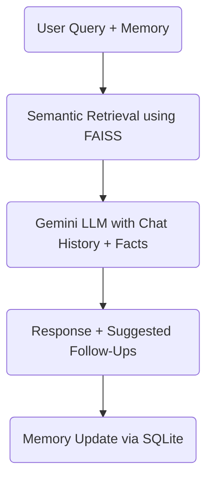

# 🔍 Simple Agentic RAG with LangGraph, Gemini & FAISS

This is a full-stack example of a **Retrieval-Augmented Generation (RAG)** system enhanced with:

- 🧠 **LangGraph** for agentic flows
- 🔎 **FAISS** for fast local semantic retrieval
- 🧬 **Gemini API** for language generation + embeddings
- 💾 **Session memory** using SQLite
- ⚛️ **React + Bootstrap UI** with follow-up suggestions

---

## 📂 Folder Structure

```
simple-agentic-rag-langgraph/
├── langgraph-backend/
│   ├── app.py
│   ├── rag_routes.py
│   ├── core/
│   │   └── langgraph_runner.py
│   ├── data/
│   │   └── info.txt
│   ├── faiss_index/
│   │   ├── index.faiss
│   │   └── index.pkl
│   ├── memory.db
│   ├── utils/
│   │   └── cosine_similarity.py
│   ├── .env
│   ├── requirements.txt
│   └── README.md
├── agentic-rag-ui/
│   └── (React frontend)
```

---

## 🔧 Setup Instructions

### 1. Backend Setup

```bash
cd langgraph-backend
python -m venv venv
venv\Scripts\activate  # or source venv/bin/activate (Mac/Linux)

pip install -r requirements.txt
```

### 2. Add your Gemini API key to `.env`

```
GEMINI_API_KEY=your_google_api_key_here
```

### 3. Start Flask server

```bash
python app.py
# Runs on http://localhost:5000
```

---

### 4. Frontend Setup

```bash
cd agentic-rag-ui
npm install
npm run dev
# Runs on http://localhost:5173
```

---

## 🧠 LangGraph Agent Flow



- **Vector DB**: FAISS (with local persistence in `faiss_index/`)
- **Memory**: SQLite stores past user/AI messages
- **FAISS** = handles semantic search, memory of facts (vector store)
- **SQLite** = memory of conversation (chat logs)
- **LangGraph** wraps this into a state machine

---

## 🧪 Features

- ✅ Semantic search over your own `.txt` documents
- ✅ Persistent FAISS index
- ✅ LangGraph agent flow with memory
- ✅ Gemini API for embeddings and chat
- ✅ Follow-up question generation
- ✅ Reset session & view chat history
- ✅ Friendly UI with Markdown rendering

---

