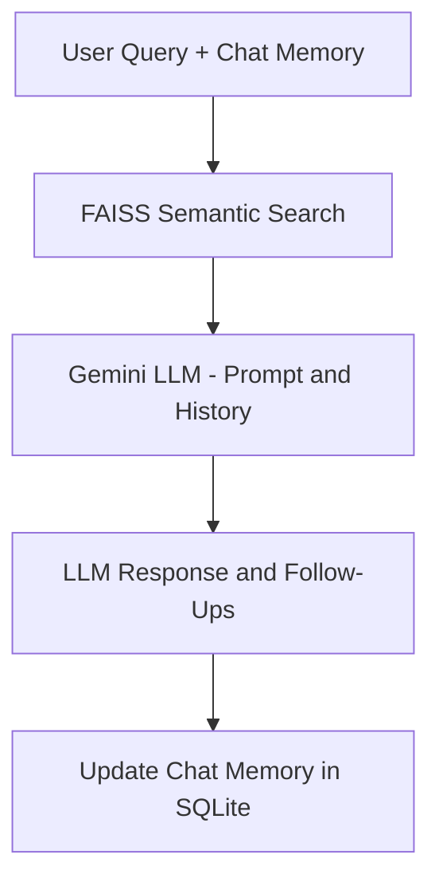

# 🌐 Simple Agentic RAG App — GitHub Pages Overview

This GitHub Pages site serves as a landing page and documentation for the full-stack Agentic RAG app using:

- 🧠 LangGraph for agentic flows and memory handling
- 🔍 FAISS for semantic retrieval over local docs
- 🤖 Gemini API for chat and embeddings
- ⚛️ React frontend with Bootstrap UI

---

## ⚙️ Quick Start

1. Clone the repository:

```
git clone https://github.com/yourusername/simple-agentic-rag-langgraph.git
```

2. Navigate to backend and frontend folders and follow setup steps from [README](../blob/main/langgraph-backend/README.md).

---

### LangGraph Flow



---

## 🎓 Educational Use

This project is used in my course to teach:
- LangGraph flows
- Agentic memory handling
- Practical vector search with Gemini embeddings
- Building real-world RAG tools

---

## 💻 Project Structure

```
simple-agentic-rag-langgraph/
├── langgraph-backend/
│   ├── app.py, rag_routes.py, core/, utils/, faiss_index/
├── agentic-rag-ui/
│   └── (React frontend)
├── docs/
│   └── index.md  ← this file
```

---

## 🔗 Resources

- 🔗 [LangGraph Docs](https://docs.langchain.com/langgraph)
- 🔗 [Gemini API](https://ai.google.dev)
- 🔗 [FAISS GitHub](https://github.com/facebookresearch/faiss)
- 🔗 [LangChain VectorStores](https://docs.langchain.com/docs/integrations/vectorstores/faiss)

---

© 2025 MIT License. Created for educational purposes.
